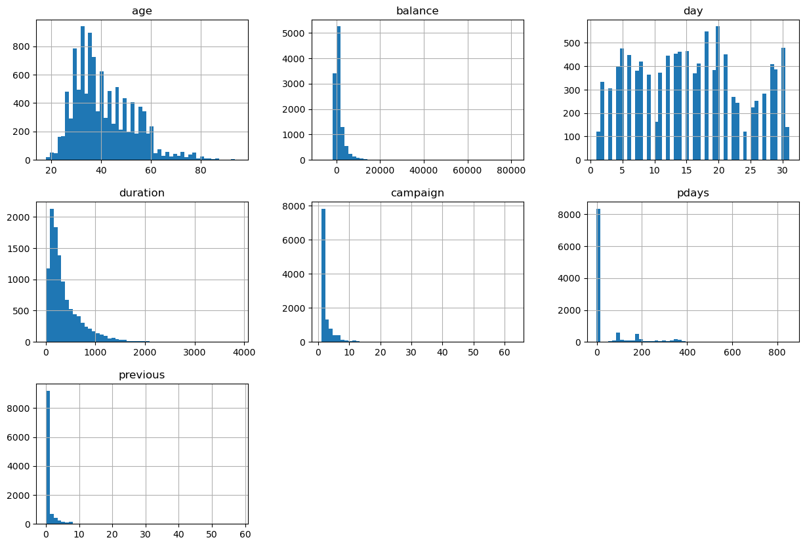
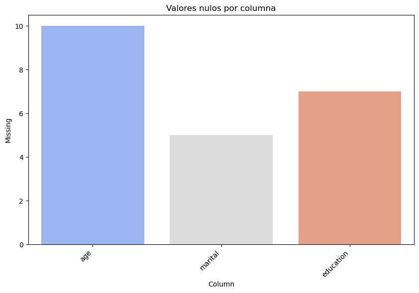
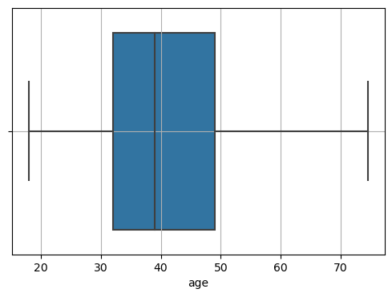
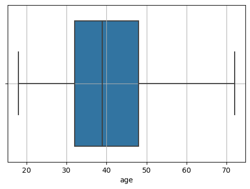
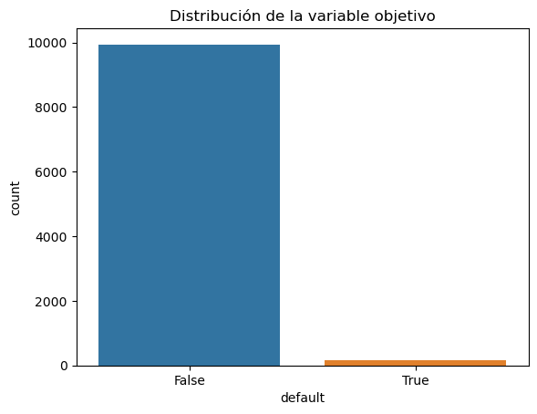

# Exploratory Data Analysis (EDA): "bank_dataset.csv"

# 1 - Importación de Librerías


```python
import pandas as pd
import numpy as np
import matplotlib.pyplot as plt
import seaborn as sns
!pip install sweetviz
import sweetviz as sv
```

    Requirement already satisfied: sweetviz in c:\users\victo\anaconda3\lib\site-packages (2.3.1)
    Requirement already satisfied: numpy>=1.16.0 in c:\users\victo\anaconda3\lib\site-packages (from sweetviz) (1.21.5)
    Requirement already satisfied: tqdm>=4.43.0 in c:\users\victo\anaconda3\lib\site-packages (from sweetviz) (4.64.1)
    Requirement already satisfied: jinja2>=2.11.1 in c:\users\victo\anaconda3\lib\site-packages (from sweetviz) (2.11.3)
    Requirement already satisfied: matplotlib>=3.1.3 in c:\users\victo\anaconda3\lib\site-packages (from sweetviz) (3.5.2)
    Requirement already satisfied: scipy>=1.3.2 in c:\users\victo\anaconda3\lib\site-packages (from sweetviz) (1.9.1)
    Requirement already satisfied: importlib-resources>=1.2.0 in c:\users\victo\anaconda3\lib\site-packages (from sweetviz) (6.4.5)
    Requirement already satisfied: pandas!=1.0.0,!=1.0.1,!=1.0.2,>=0.25.3 in c:\users\victo\anaconda3\lib\site-packages (from sweetviz) (1.4.4)
    Requirement already satisfied: zipp>=3.1.0 in c:\users\victo\anaconda3\lib\site-packages (from importlib-resources>=1.2.0->sweetviz) (3.8.0)
    Requirement already satisfied: MarkupSafe>=0.23 in c:\users\victo\anaconda3\lib\site-packages (from jinja2>=2.11.1->sweetviz) (2.0.1)
    Requirement already satisfied: pillow>=6.2.0 in c:\users\victo\anaconda3\lib\site-packages (from matplotlib>=3.1.3->sweetviz) (9.2.0)
    Requirement already satisfied: kiwisolver>=1.0.1 in c:\users\victo\anaconda3\lib\site-packages (from matplotlib>=3.1.3->sweetviz) (1.4.2)
    Requirement already satisfied: fonttools>=4.22.0 in c:\users\victo\anaconda3\lib\site-packages (from matplotlib>=3.1.3->sweetviz) (4.25.0)
    Requirement already satisfied: packaging>=20.0 in c:\users\victo\anaconda3\lib\site-packages (from matplotlib>=3.1.3->sweetviz) (21.3)
    Requirement already satisfied: python-dateutil>=2.7 in c:\users\victo\anaconda3\lib\site-packages (from matplotlib>=3.1.3->sweetviz) (2.8.2)
    Requirement already satisfied: pyparsing>=2.2.1 in c:\users\victo\anaconda3\lib\site-packages (from matplotlib>=3.1.3->sweetviz) (3.0.9)
    Requirement already satisfied: cycler>=0.10 in c:\users\victo\anaconda3\lib\site-packages (from matplotlib>=3.1.3->sweetviz) (0.11.0)
    Requirement already satisfied: pytz>=2020.1 in c:\users\victo\anaconda3\lib\site-packages (from pandas!=1.0.0,!=1.0.1,!=1.0.2,>=0.25.3->sweetviz) (2024.2)
    Requirement already satisfied: colorama in c:\users\victo\anaconda3\lib\site-packages (from tqdm>=4.43.0->sweetviz) (0.4.5)
    Requirement already satisfied: six>=1.5 in c:\users\victo\anaconda3\lib\site-packages (from python-dateutil>=2.7->matplotlib>=3.1.3->sweetviz) (1.16.0)
    

# 2 - Carga del dataset "raw" desde github


```python
df = pd.read_csv('https://raw.githubusercontent.com/ITACADEMYprojectes/projecteML/e8d1aab0a24ddf55af9dfd9e83b1ea79e34c1af9/bank_dataset.CSV')
```

# 3 -  Exploración del dataset

## Información general del dataset


```python
df.info()
```

    <class 'pandas.core.frame.DataFrame'>
    RangeIndex: 11162 entries, 0 to 11161
    Data columns (total 17 columns):
     #   Column     Non-Null Count  Dtype  
    ---  ------     --------------  -----  
     0   age        11152 non-null  float64
     1   job        11162 non-null  object 
     2   marital    11157 non-null  object 
     3   education  11155 non-null  object 
     4   default    11162 non-null  object 
     5   balance    11162 non-null  int64  
     6   housing    11162 non-null  object 
     7   loan       11162 non-null  object 
     8   contact    11162 non-null  object 
     9   day        11162 non-null  int64  
     10  month      11162 non-null  object 
     11  duration   11162 non-null  int64  
     12  campaign   11162 non-null  int64  
     13  pdays      11162 non-null  int64  
     14  previous   11162 non-null  int64  
     15  poutcome   11162 non-null  object 
     16  deposit    11162 non-null  object 
    dtypes: float64(1), int64(6), object(10)
    memory usage: 1.4+ MB
    

## Visualización primeras filas


```python
df.head()
```


<div>
<style scoped>
    .dataframe tbody tr th:only-of-type {
        vertical-align: middle;
    }

    .dataframe tbody tr th {
        vertical-align: top;
    }

    .dataframe thead th {
        text-align: right;
    }
</style>
<table border="1" class="dataframe">
  <thead>
    <tr style="text-align: right;">
      <th></th>
      <th>age</th>
      <th>job</th>
      <th>marital</th>
      <th>education</th>
      <th>default</th>
      <th>balance</th>
      <th>housing</th>
      <th>loan</th>
      <th>contact</th>
      <th>day</th>
      <th>month</th>
      <th>duration</th>
      <th>campaign</th>
      <th>pdays</th>
      <th>previous</th>
      <th>poutcome</th>
      <th>deposit</th>
    </tr>
  </thead>
  <tbody>
    <tr>
      <th>0</th>
      <td>59.0</td>
      <td>admin.</td>
      <td>married</td>
      <td>secondary</td>
      <td>no</td>
      <td>2343</td>
      <td>yes</td>
      <td>no</td>
      <td>unknown</td>
      <td>5</td>
      <td>may</td>
      <td>1042</td>
      <td>1</td>
      <td>-1</td>
      <td>0</td>
      <td>unknown</td>
      <td>yes</td>
    </tr>
    <tr>
      <th>1</th>
      <td>56.0</td>
      <td>admin.</td>
      <td>married</td>
      <td>secondary</td>
      <td>no</td>
      <td>45</td>
      <td>no</td>
      <td>no</td>
      <td>unknown</td>
      <td>5</td>
      <td>may</td>
      <td>1467</td>
      <td>1</td>
      <td>-1</td>
      <td>0</td>
      <td>unknown</td>
      <td>yes</td>
    </tr>
    <tr>
      <th>2</th>
      <td>41.0</td>
      <td>technician</td>
      <td>married</td>
      <td>secondary</td>
      <td>no</td>
      <td>1270</td>
      <td>yes</td>
      <td>no</td>
      <td>unknown</td>
      <td>5</td>
      <td>may</td>
      <td>1389</td>
      <td>1</td>
      <td>-1</td>
      <td>0</td>
      <td>unknown</td>
      <td>yes</td>
    </tr>
    <tr>
      <th>3</th>
      <td>55.0</td>
      <td>services</td>
      <td>married</td>
      <td>secondary</td>
      <td>no</td>
      <td>2476</td>
      <td>yes</td>
      <td>no</td>
      <td>unknown</td>
      <td>5</td>
      <td>may</td>
      <td>579</td>
      <td>1</td>
      <td>-1</td>
      <td>0</td>
      <td>unknown</td>
      <td>yes</td>
    </tr>
    <tr>
      <th>4</th>
      <td>54.0</td>
      <td>admin.</td>
      <td>married</td>
      <td>tertiary</td>
      <td>no</td>
      <td>184</td>
      <td>no</td>
      <td>no</td>
      <td>unknown</td>
      <td>5</td>
      <td>may</td>
      <td>673</td>
      <td>2</td>
      <td>-1</td>
      <td>0</td>
      <td>unknown</td>
      <td>yes</td>
    </tr>
  </tbody>
</table>
</div>


# 4 - Descripción estadística del dataset


## Estadísticas descriptivas para variables numéricas


```python
df.describe()
```


<div>
<style scoped>
    .dataframe tbody tr th:only-of-type {
        vertical-align: middle;
    }

    .dataframe tbody tr th {
        vertical-align: top;
    }

    .dataframe thead th {
        text-align: right;
    }
</style>
<table border="1" class="dataframe">
  <thead>
    <tr style="text-align: right;">
      <th></th>
      <th>age</th>
      <th>balance</th>
      <th>day</th>
      <th>duration</th>
      <th>campaign</th>
      <th>pdays</th>
      <th>previous</th>
    </tr>
  </thead>
  <tbody>
    <tr>
      <th>count</th>
      <td>11152.000000</td>
      <td>11162.000000</td>
      <td>11162.000000</td>
      <td>11162.000000</td>
      <td>11162.000000</td>
      <td>11162.000000</td>
      <td>11162.000000</td>
    </tr>
    <tr>
      <th>mean</th>
      <td>41.235384</td>
      <td>1528.538524</td>
      <td>15.658036</td>
      <td>371.993818</td>
      <td>2.508421</td>
      <td>51.330407</td>
      <td>0.832557</td>
    </tr>
    <tr>
      <th>std</th>
      <td>11.914934</td>
      <td>3225.413326</td>
      <td>8.420740</td>
      <td>347.128386</td>
      <td>2.722077</td>
      <td>108.758282</td>
      <td>2.292007</td>
    </tr>
    <tr>
      <th>min</th>
      <td>18.000000</td>
      <td>-6847.000000</td>
      <td>1.000000</td>
      <td>2.000000</td>
      <td>1.000000</td>
      <td>-1.000000</td>
      <td>0.000000</td>
    </tr>
    <tr>
      <th>25%</th>
      <td>32.000000</td>
      <td>122.000000</td>
      <td>8.000000</td>
      <td>138.000000</td>
      <td>1.000000</td>
      <td>-1.000000</td>
      <td>0.000000</td>
    </tr>
    <tr>
      <th>50%</th>
      <td>39.000000</td>
      <td>550.000000</td>
      <td>15.000000</td>
      <td>255.000000</td>
      <td>2.000000</td>
      <td>-1.000000</td>
      <td>0.000000</td>
    </tr>
    <tr>
      <th>75%</th>
      <td>49.000000</td>
      <td>1708.000000</td>
      <td>22.000000</td>
      <td>496.000000</td>
      <td>3.000000</td>
      <td>20.750000</td>
      <td>1.000000</td>
    </tr>
    <tr>
      <th>max</th>
      <td>95.000000</td>
      <td>81204.000000</td>
      <td>31.000000</td>
      <td>3881.000000</td>
      <td>63.000000</td>
      <td>854.000000</td>
      <td>58.000000</td>
    </tr>
  </tbody>
</table>
</div>


## Estadísticas descriptivas para variables categóricas


```python
df.describe(include=['object'])
```


<div>
<style scoped>
    .dataframe tbody tr th:only-of-type {
        vertical-align: middle;
    }

    .dataframe tbody tr th {
        vertical-align: top;
    }

    .dataframe thead th {
        text-align: right;
    }
</style>
<table border="1" class="dataframe">
  <thead>
    <tr style="text-align: right;">
      <th></th>
      <th>job</th>
      <th>marital</th>
      <th>education</th>
      <th>default</th>
      <th>housing</th>
      <th>loan</th>
      <th>contact</th>
      <th>month</th>
      <th>poutcome</th>
      <th>deposit</th>
    </tr>
  </thead>
  <tbody>
    <tr>
      <th>count</th>
      <td>11162</td>
      <td>11157</td>
      <td>11155</td>
      <td>11162</td>
      <td>11162</td>
      <td>11162</td>
      <td>11162</td>
      <td>11162</td>
      <td>11162</td>
      <td>11162</td>
    </tr>
    <tr>
      <th>unique</th>
      <td>12</td>
      <td>3</td>
      <td>4</td>
      <td>2</td>
      <td>2</td>
      <td>2</td>
      <td>3</td>
      <td>12</td>
      <td>4</td>
      <td>2</td>
    </tr>
    <tr>
      <th>top</th>
      <td>management</td>
      <td>married</td>
      <td>secondary</td>
      <td>no</td>
      <td>no</td>
      <td>no</td>
      <td>cellular</td>
      <td>may</td>
      <td>unknown</td>
      <td>no</td>
    </tr>
    <tr>
      <th>freq</th>
      <td>2566</td>
      <td>6349</td>
      <td>5474</td>
      <td>10994</td>
      <td>5881</td>
      <td>9702</td>
      <td>8042</td>
      <td>2824</td>
      <td>8326</td>
      <td>5873</td>
    </tr>
  </tbody>
</table>
</div>


## Histograma de cada variable numérica


```python
df.hist(bins=50, figsize=(15, 10))
plt.show()
```


    

    


## Recuento de los valores de cada variable categórica


```python
for column in df.select_dtypes(include=['object']).columns:
    print(df[column].value_counts())
```

    management       2566
    blue-collar      1944
    technician       1823
    admin.           1334
    services          923
    retired           778
    self-employed     405
    student           360
    unemployed        357
    entrepreneur      328
    housemaid         274
    unknown            70
    Name: job, dtype: int64
    married     6349
    single      3517
    divorced    1291
    Name: marital, dtype: int64
    secondary    5474
    tertiary     3685
    primary      1500
    unknown       496
    Name: education, dtype: int64
    no     10994
    yes      168
    Name: default, dtype: int64
    no     5881
    yes    5281
    Name: housing, dtype: int64
    no     9702
    yes    1460
    Name: loan, dtype: int64
    cellular     8042
    unknown      2346
    telephone     774
    Name: contact, dtype: int64
    may    2824
    aug    1519
    jul    1514
    jun    1222
    nov     943
    apr     923
    feb     776
    oct     392
    jan     344
    sep     319
    mar     276
    dec     110
    Name: month, dtype: int64
    unknown    8326
    failure    1228
    success    1071
    other       537
    Name: poutcome, dtype: int64
    no     5873
    yes    5289
    Name: deposit, dtype: int64
    

# 5 - Gestión valores nulos

## Recuento valores nulos por columna


```python
df.isnull().sum()
```


    age          10
    job           0
    marital       5
    education     7
    default       0
    balance       0
    housing       0
    loan          0
    contact       0
    day           0
    month         0
    duration      0
    campaign      0
    pdays         0
    previous      0
    poutcome      0
    deposit       0
    dtype: int64


## Visualización de valores nulos


```python
# Como son pocos los valores nulos en un mapa de calor no se visualizan bien, por lo que voy a crear un DataFrame para valores nulos y luego graficarlos
missing_data = df.isnull().sum().reset_index()
missing_data.columns = ['Column', 'Missing']
missing_data = missing_data[missing_data['Missing'] > 0]

# Graficar
plt.figure(figsize=(10, 6))
sns.barplot(x="Column", y="Missing", data=missing_data, palette="coolwarm")
plt.xticks(rotation=45, ha='right')
plt.title("Valores nulos por columna")
plt.show()
```


    

    


## Imputación de valores a las columnas con nulos

### Para la variable númerica "age" uso la mediana


```python
df['age'] = df['age'].fillna(df['age'].median())
```

### Para las variables categóricas "marital" y "education" uso la moda, que es el valor que aparece con mayor frecuencia


```python
df['marital'] = df['marital'].fillna(df['marital'].mode()[0])
df['education'] = df['education'].fillna(df['education'].mode()[0])
```

### comprobación


```python
df.isnull().sum()
```


    age          0
    job          0
    marital      0
    education    0
    default      0
    balance      0
    housing      0
    loan         0
    contact      0
    day          0
    month        0
    duration     0
    campaign     0
    pdays        0
    previous     0
    poutcome     0
    deposit      0
    dtype: int64


# 6 - Gestión de valores atípicos (outliers)

## Detección de outliers 

### Detección de outliers con boxplots


```python
# Creación de subplots para cada variable numérica
columnas_numericas = df.select_dtypes(include=[np.number])
fig, axes = plt.subplots(len(columnas_numericas.columns), 1, figsize=(8, 12))

# Boxplot para cada columna numérica
for i, column in enumerate(columnas_numericas.columns):
    sns.boxplot(data=df, x=column, ax=axes[i], palette="coolwarm")
    axes[i].set_title(f"Boxplot de {column}")

plt.tight_layout()
plt.show()
```


    

    


### Detección de outliers con Z-score


```python
from scipy.stats import zscore

# Calculo de Z-scores para variables numéricas
z_scores = pd.DataFrame(zscore(df.select_dtypes(include=[np.number])), 
                        columns=df.select_dtypes(include=[np.number]).columns)

# Visualización de los Z-scores
print(z_scores.head())
```

            age   balance       day  duration  campaign     pdays  previous
    0  1.491834  0.252525 -1.265746  1.930226 -0.554168 -0.481184  -0.36326
    1  1.239929 -0.459974 -1.265746  3.154612 -0.554168 -0.481184  -0.36326
    2 -0.019597 -0.080160 -1.265746  2.929901 -0.554168 -0.481184  -0.36326
    3  1.155960  0.293762 -1.265746  0.596366 -0.554168 -0.481184  -0.36326
    4  1.071992 -0.416876 -1.265746  0.867171 -0.186785 -0.481184  -0.36326
    


```python
# Identificar columnas con outliers según un umbral de 3
outliers_by_column = (z_scores > 3).sum()
print("Cantidad de outliers por columna:")
print(outliers_by_column)
```

    Cantidad de outliers por columna:
    age         132
    balance     173
    day           0
    duration    201
    campaign    210
    pdays       176
    previous    220
    dtype: int64
    

## Eliminación de outliers utilizando Z-score


```python
df = df[(z_scores < 3).all(axis=1)]
```


```python
print(df.head())
```

        age         job  marital  education default  balance housing loan  \
    0  59.0      admin.  married  secondary      no     2343     yes   no   
    2  41.0  technician  married  secondary      no     1270     yes   no   
    3  55.0    services  married  secondary      no     2476     yes   no   
    4  54.0      admin.  married   tertiary      no      184      no   no   
    5  42.0  management   single   tertiary      no        0     yes  yes   
    
       contact  day month  duration  campaign  pdays  previous poutcome deposit  
    0  unknown    5   may      1042         1     -1         0  unknown     yes  
    2  unknown    5   may      1389         1     -1         0  unknown     yes  
    3  unknown    5   may       579         1     -1         0  unknown     yes  
    4  unknown    5   may       673         2     -1         0  unknown     yes  
    5  unknown    5   may       562         2     -1         0  unknown     yes  
    

# 7 - Identificación de características relevantes


```python
# Transformo los valores "yes" a True y "no" a False de las variables "default" (mi variable objetivo), "loan" y "deposit", para que sean booleana y mas fácil de trabajar mas adelante.

df['default'] = df['default'].map({'yes': True, 'no': False})
df['loan'] = df['loan'].map({'yes': True, 'no': False})
df['deposit'] = df['deposit'].map({'yes': True, 'no': False})

print(df['default'].dtype)
print(df['loan'].dtype) 
print(df['deposit'].dtype) 
```

    bool
    bool
    bool
    


```python
# Matriz de correlación para variables numéricas
corr_matrix = df.corr()
sns.heatmap(corr_matrix, annot=True, cmap='coolwarm')
plt.title("Matriz de correlación")
plt.show()
```


    

    


```python
# Análisis de variables categóricas frente a la variable objetivo "default"
for col in df.select_dtypes(include=['object']).columns:
    print(f"\nDistribución de {col} respecto a la variable objetivo:")
    print(df.groupby(col)['default'].value_counts(normalize=True))
```

    
    Distribución de job respecto a la variable objetivo:
    job            default
    admin.         False      0.991756
                   True       0.008244
    blue-collar    False      0.977998
                   True       0.022002
    entrepreneur   False      0.967213
                   True       0.032787
    housemaid      False      0.972973
                   True       0.027027
    management     False      0.985300
                   True       0.014700
    retired        False      0.991803
                   True       0.008197
    self-employed  False      0.977778
                   True       0.022222
    services       False      0.991736
                   True       0.008264
    student        False      0.996997
                   True       0.003003
    technician     False      0.984290
                   True       0.015710
    unemployed     False      0.978462
                   True       0.021538
    unknown        False      0.983333
                   True       0.016667
    Name: default, dtype: float64
    
    Distribución de marital respecto a la variable objetivo:
    marital   default
    divorced  False      0.978355
              True       0.021645
    married   False      0.985351
              True       0.014649
    single    False      0.985354
              True       0.014646
    Name: default, dtype: float64
    
    Distribución de education respecto a la variable objetivo:
    education  default
    primary    False      0.978963
               True       0.021037
    secondary  False      0.984384
               True       0.015616
    tertiary   False      0.987699
               True       0.012301
    unknown    False      0.979499
               True       0.020501
    Name: default, dtype: float64
    
    Distribución de housing respecto a la variable objetivo:
    housing  default
    no       False      0.985587
             True       0.014413
    yes      False      0.983420
             True       0.016580
    Name: default, dtype: float64
    
    Distribución de contact respecto a la variable objetivo:
    contact    default
    cellular   False      0.986570
               True       0.013430
    telephone  False      0.993432
               True       0.006568
    unknown    False      0.975365
               True       0.024635
    Name: default, dtype: float64
    
    Distribución de month respecto a la variable objetivo:
    month  default
    apr    False      0.991832
           True       0.008168
    aug    False      0.986436
           True       0.013564
    dec    False      1.000000
    feb    False      0.992867
           True       0.007133
    jan    False      0.980519
           True       0.019481
    jul    False      0.968172
           True       0.031828
    jun    False      0.980144
           True       0.019856
    mar    False      1.000000
    may    False      0.984945
           True       0.015055
    nov    False      0.983664
           True       0.016336
    oct    False      1.000000
    sep    False      0.996109
           True       0.003891
    Name: default, dtype: float64
    
    Distribución de poutcome respecto a la variable objetivo:
    poutcome  default
    failure   False      0.994152
              True       0.005848
    other     False      0.992771
              True       0.007229
    success   False      1.000000
    unknown   False      0.981057
              True       0.018943
    Name: default, dtype: float64
    

# 8 - Gestión del desbalance de clases


```python
# Distribución de la variable objetivo "default"
print(df['default'].value_counts(normalize=True))

# Visualización de la distribución
sns.countplot(data=df, x='default')
plt.title("Distribución de la variable objetivo")
plt.show()
```

    False    0.984551
    True     0.015449
    Name: default, dtype: float64
    


    

    


```python
#Creación de los sets

default_false= df[df['default'] == False]
default_true= df[df['default'] == True]

print(default_true.count())
```

    age          156
    job          156
    marital      156
    education    156
    default      156
    balance      156
    housing      156
    loan         156
    contact      156
    day          156
    month        156
    duration     156
    campaign     156
    pdays        156
    previous     156
    poutcome     156
    deposit      156
    dtype: int64
    


```python
# Como existe un gran desbalance hago un submuestreo de los "false" a 156 que es la cantidad de "true" que hay:

submuestreo_false = default_false.sample(n=156, replace=False, random_state=0)

print(submuestreo_false.count())
```

    age          156
    job          156
    marital      156
    education    156
    default      156
    balance      156
    housing      156
    loan         156
    contact      156
    day          156
    month        156
    duration     156
    campaign     156
    pdays        156
    previous     156
    poutcome     156
    deposit      156
    dtype: int64
    

# 9 - EDA automático con Sweetviz


```python
report = sv.analyze(df)
report.show_html('EDA_report.html')
```

# 10 - Conclusión final


Cómo conclusión se puede decir que no se requirieron muchas modificaciones al dataset

Del análisis inicial se vio que el dataset contenía 17 columnas y 11162 filas (registros). 

Se identificaron 27 valores nulos en 3 columnas y se aplico imputación.

Se detectaron valores atípicos en 6 variables numéricas y fueron gestionados mediante eliminación con el z-score.

REspecto a la relación entre variables, para seguir en sintonía con las tareas anteriores, mantuve la variable objetivo "default" y la converti junto con otras 2 variables a booleana.

Ninguna variable mostro una correlacion significativa con mi variable objetivo por lo cual deduzco que de continuar con este dataset debere cambiar la variable a predecir para tener un mejor modelo.

Por ultimo detecte un gran desbalance en la variable objetivo, con una proporción del 99% frente al 1% aproximadamente, por lo cual aplique un submuestreo para tener dos subsets similares. En base a esto reafirmo que la variable objetivo elegida inicialmente no es el óptima para este dataset.
